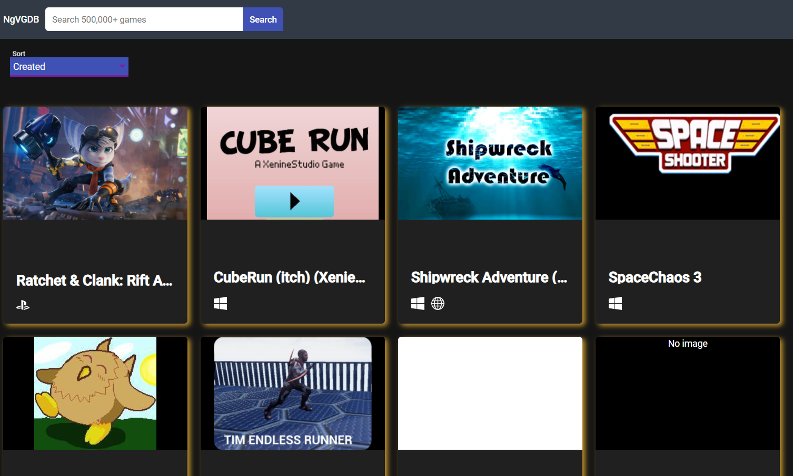

<p align="center">
<div align="center" id="top"> 
  

&#xa0;

</div>
</p>

<h3 align="center"> 📽️ng-video-game-db📽️</h3>

<p align="center">
 ▶️
  Project Which use Public API to create this interesting game database website.
  Project set up using Angular CLI and which include Components, HTTP Calls,
  HTTP Interceptors implementation, Services, Routes, Pass data with Routes in
  between the Components. Using Pipes for data formatting and various Angular
  Directives like ngFor and ngIf and so much more.
  <br />
</p>

## 📝 Table of Contents

<p>

🏁 This is my first README file configuration. Main purpose is to improve skills with
Angular!

🏗️ instructions will get you a copy of the project up and running on your
local machine

</p>
<br />

# 🦍 Development server

#### ✏️ Run ng serve for a dev server. Navigate to http://localhost:4200/. The app will automatically reload if you change any of the source files.

# 🐶 Code scaffolding

#### ✏️ Run ng generate component component-name to generate a new component. You can also use ng generate directive|pipe|service|class|guard|interface|enum|module.

# 🐱 Build

```bash
# Clone this project
$ git clone https://github.com/Tadeoz24/NG-VIDEO-GAME-DB

# Access
$ cd NG-VIDEO-GAME-DB

# Install dependencies
$ npm install

# Run the project
$ ng serve

# The server will initialize in the <http://localhost:4200>
```

# 🦁 Running unit tests

#### ✏️ Run ng test to execute the unit tests via <h3> <a href="https://karma-runner.github.io/latest/index.html">Karma (is a spread operator 💦 )</a></h3>

# 🐟 Running end-to-end tests

#### ✏️ Run ng e2e to execute the end-to-end tests via</h5><h3> <a href="http://www.protractortest.org/#/">Protractor</a></h3>

# 🐖 Further help

#### ✏️ To get more help on the Angular CLI use ng help or go check out the </h5><h3> <a href="https://angular.io/cli">Angular CLI Overview and Command Reference page</a></h3>

<br />

# :ballot_box: Using Materials

  <ul>
    <li>[RAWG Video Games Database](https://rapidapi.com/accujazz/api/rawg-video-games-database/details) - Database</li>
    <li>[Express](https://expressjs.com/) - Server Framework -</li>
    <li>[Angular](https://angular.io/) - Web Framework -</li>
    <li>[Angular Material ](https://material.angular.io/) - Styles -</li>
    <li>[Angular Gauge ](https://www.npmjs.com/package/angular-gauge) - Display Rating -</li>
    <li>[NodeJs](https://nodejs.org/en/) - Server Environment</li>
    <li>[Public API] (https://rapidapi.com/accujazz/api/rawg-video-games-database/details) - API </li>
  </br>
  </ul>
    </br>

## :memo: License

This project is under license from MIT. For more details, see the [LICENSE](LICENSE.md) file.

Made with :heart: by <a href="https://github.com/Tadeoz24/" target="_blank">Tadeoz Gvaladze</a>

&#xa0;

<a href="#top">Back to top</a>
